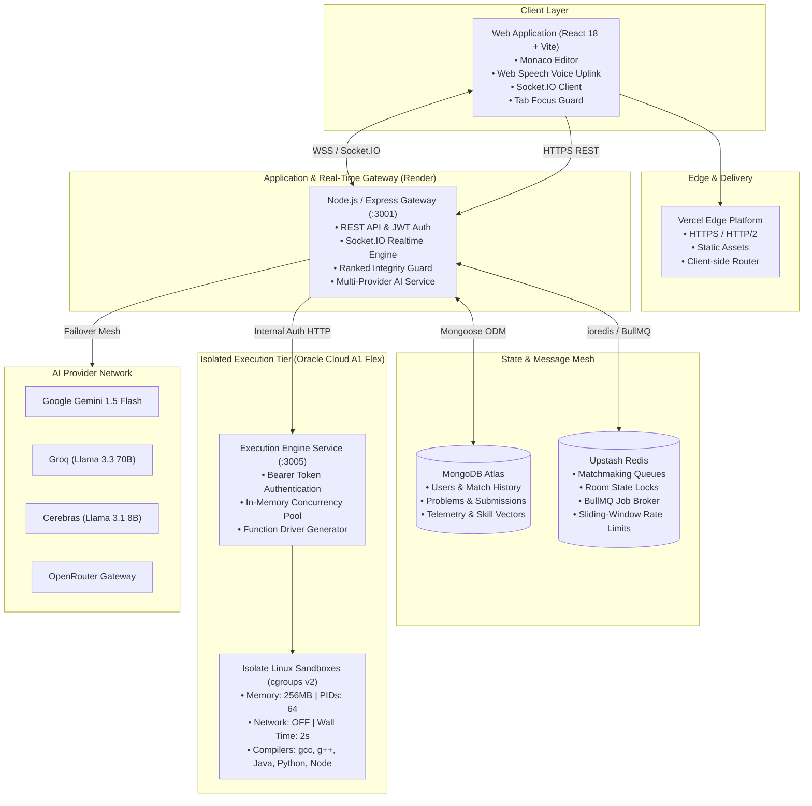

# CodeArena — Real-Time Voice-Assisted Competitive Coding Platform

<div align="center">

[](https://opensource.org/licenses/MIT)
[](https://www.typescriptlang.org/)
[](https://react.dev/)
[](https://nodejs.org/)
[](https://socket.io/)
[](https://www.mongodb.com/)
[](https://upstash.com/)
[](https://github.com/ioi/isolate)

**A production-grade, distributed real-time competitive coding platform featuring multi-language sandboxed execution, voice-to-code synthesis, Socratic AI coaching, server-enforced ranked integrity, and multi-dimensional skill vector telemetry.**

[Features](#-key-capabilities) • [Architecture](#-system-architecture) • [Tech Stack](#-technology-stack) • [Security & Sandbox](#-execution-engine--security) • [Ranked Engine](#-canonical-elo--skill-vectors) • [Getting Started](#-getting-started) • [Deployment](#-production-deployment)

</div>

---

## ⚡ Key Capabilities

### 1. Real-Time Multi-Modal Battle Arena
- **1v1 Ranked Duels & Quick Match**: Millisecond-accurate state synchronization, live keystroke/progress telemetry, and automated matchmaking via an Elo-bucketed Redis sliding window.
- **Custom Hosted Rooms**: Shareable room codes, private unranked scrims, configurable battle durations, problem selection, and real-time spectator modes.
- **Voice-to-Code & Audio Feedback**: Integrated Web Speech API for voice coding, real-time audio frequency visualizer, and synthesized spatial sound feedback.
- **Battle Focus & Departure Protection**: Server & client integrity guardrails (`useBattleFocusWarning`) that detect tab switching or window blur during competitive duels, trigger cybernetic audio alerts, enforce `beforeunload` guards, and record infractions.

### 2. Isolated Multi-Language Execution Engine (`packages/execution-engine`)
- **Kernel-Level Sandboxing**: Powered by [Isolate](https://github.com/ioi/isolate) and Linux cgroups v2, enforcing hardware-isolated CPU quotas, memory ceilings (256MB), process limits (PID 64), and total network lockout (`net=off`).
- **Zero Host Leaks**: Hardened against adversarial exploits including fork bombs, infinite loops, memory exhaustion, file descriptor escapes, and unauthorized socket bindings.
- **Full Polyglot Runtimes**: Production compilers and runtimes for **C (gcc)**, **C++ (g++17)**, **Java (OpenJDK)**, **Python (python3)**, and **JavaScript (Node.js)**.
- **LeetCode-Style Function Drivers**: Automated input/output serialization harnesses (`FunctionDriver.ts`) that test algorithmic methods against rigorous batch test suites without requiring boilerplate code from competitors.

### 3. Socratic AI Coaching & Complexity Telemetry
- **Multi-Provider AI Resilience**: Zero-downtime failover gateway (`AIProviderManager`) multiplexing between **Google Gemini (gemini-1.5-flash)**, **Groq (llama-3.3-70b-versatile)**, **Cerebras (llama3.1-8b)**, and **OpenRouter**.
- **Server-Enforced Ranked Integrity**: Strict middleware (`blockActiveRankedMatches`) returns HTTP 403 `AI_ASSIST_BLOCKED_IN_RANKED` during competitive ranked duels, completely closing off unfair AI assistance while keeping Socratic guidance active during solo practice.
- **Post-Match Code Analysis**: Automated Big-O time and space complexity derivation, code smell diagnostics, and algorithmic optimization tips generated post-match.

### 4. Canonical Elo Engine & Multi-Dimensional Skill Vectors
- **FIDE/Elo Competitive Math**: Calibrated rating system ($K=64$ placement tier, $K=32$ standard tier, $S=0.5$ draws, non-negative floor, and anti-farming match clamping).
- **7-Tier Ladder Progression**: `IRON` $\to$ `BRONZE` $\to$ `SILVER` $\to$ `GOLD` $\to$ `PLATINUM` $\to$ `DIAMOND` $\to$ `GRANDMASTER`.
- **6-Category Radar Profiling**: Unified skill telemetry measuring competencies across *Arrays, Strings, Dynamic Programming, Trees, Graphs,* and *Math* with cross-source aggregation between Practice Lab and Ranked Battles.

### 5. Recruiter Demo Mode ("Explore Demo")
- **Zero-Friction Evaluation**: 1-click temporary authenticated session without requiring manual registration or OAuth setup.
- **Seeded Calibrated Persona**: Instantly provisions an ephemeral operator (`demo_recruiter_XXXX`) seeded with 1350 RP (Silver II), 20 battles (70% win rate), and full skill vector telemetry, while safely guarding destructive profile updates with HTTP 403 restrictions.

---

## 🏛 System Architecture

CodeArena is designed as a distributed, service-oriented monorepo separating real-time state orchestration from sandboxed compute:



---

## 🛠 Technology Stack

| Layer | Technologies & Libraries | Key Responsibilities |
| :--- | :--- | :--- |
| **Frontend App** | React 18, Vite, TypeScript, Tailwind CSS | High-performance SPA with cyberpunk dark aesthetics, glassmorphism design system. |
| **Code Editor** | Monaco Editor (`@monaco-editor/react`) | In-browser IDE with IntelliSense, syntax coloring, theme switching, and custom keymaps. |
| **Real-Time Mesh** | Socket.IO Client & Server, Engine.IO | Low-latency bi-directional matchmaking, battle room signaling, and spectator relay. |
| **Backend Core** | Node.js, Express, TypeScript, Helmet | REST API endpoints, JWT authentication with refresh rotation, rate limiting, and CORS. |
| **Database** | MongoDB Atlas, Mongoose ODM | Document storage for problems, test cases, users, match history, and skill matrices. |
| **Cache & Queue** | Upstash Redis, BullMQ | Distributed locks, matchmaking queues, rate limiter buckets, and background job processing. |
| **Execution Sandbox** | Isolate, Linux cgroups v2, nsjail | Kernel-isolated sandboxing preventing CPU/memory exhaustion and host escapes. |
| **AI Intelligence** | Google Gemini, Groq SDK, Cerebras, OpenRouter | Socratic practice coaching, post-match complexity evaluation, and AST code reviews. |
| **Audio & Voice** | Web Speech API, Web Audio API, Canvas | Voice-to-code transcription, audio frequency analyzer, synthesized alerts. |
| **Testing & QA** | Jest, Supertest, tsx scripts | Automated verification suites covering Elo math, adversarial security, and AI guardrails. |

---

## 🛡 Execution Engine & Security

The standalone execution engine located in [`packages/execution-engine`](file:///d:/Projects/CodeArena/packages/execution-engine) executes untrusted code submitted by players with strict host protections:

### Kernel Isolation Specs
- **cgroups v2 Resource Throttling**: Memory hard cap at `256MB`, maximum CPU cores capped at `1`, process tree limit capped at `64 PIDs`.
- **Network Isolation**: Disabled completely (`--net=none`) ensuring user code cannot open sockets, initiate DDoS attacks, or contact external servers.
- **Filesystem Chroot**: Code runs within an ephemeral tmpfs chroot directory. All changes are wiped clean immediately upon process exit.
- **System Call Whitelisting**: Restricted system calls via seccomp filters preventing kernel escalation or unauthorized device access.

### Adversarial Security Suite
Automated regression tests verify protection against common programming attack vectors:
```
packages/execution-engine/tests/adversarial/
├── file_escape.cpp      -> Tests /etc/passwd and host path traversal (Blocked)
├── fork_bomb.cpp        -> Tests exponential thread/process replication (Clamped at PID limit)
├── infinite_loop.cpp    -> Tests CPU starvation (Terminated at 2000ms wall-time)
├── large_output.cpp     -> Tests stdout flooding / buffer overflow (Capped at 1024KB)
├── memory_abuse.cpp     -> Tests heap allocation starvation (Killed via OOM killer)
└── network_escape.cpp   -> Tests outbound TCP socket creation (Blocked via net isolation)
```

---

## 📊 Canonical Elo & Skill Vectors

CodeArena implements standard FIDE Elo rating calculations with competitive adaptations:

$$\Delta R_A = K \cdot (S_A - E_A), \quad E_A = \frac{1}{1 + 10^{(R_B - R_A) / 400}}$$

- **Placement Tier ($K=64$)**: Rapid calibration across a player's first 5 competitive matches.
- **Standard Tier ($K=32$)**: Stable Elo progression for established players.
- **Draw Score ($S=0.5$)**: Symmetric calculation where underdogs gain rating and favorites lose rating in tied matches.
- **Anti-Farming Dampening**: Clamps repeated matchups between identical players within sliding windows to prevent rating manipulation.

### Unified 6-Dimensional Skill Matrix
Player competency is mapped across six canonical problem domains:
1. **Arrays** — Sliding window, two-pointers, prefix sums, binary search.
2. **Strings** — Parsing, string matching, palindromes, tries.
3. **Dynamic Programming** — Memoization, bottom-up tabulation, knapsack variants.
4. **Trees** — Binary trees, BSTs, tree traversals, lowest common ancestor.
5. **Graphs** — BFS, DFS, shortest path algorithms, topological sorting.
6. **Math** — Combinatorics, number theory, prime factorization, bitwise tricks.

---

## 📁 Repository Monorepo Structure

```
CodeArena/
├── apps/
│   ├── server/                     # Express REST + Socket.IO Realtime Backend
│   │   ├── src/
│   │   │   ├── config/             # Environment & database configurations
│   │   │   ├── lib/ai/             # Multi-provider AI manager & providers
│   │   │   ├── lib/execution/      # Execution engine client & function drivers
│   │   │   ├── middleware/         # Auth, rate limiting, and ranked integrity
│   │   │   ├── models/             # Mongoose schemas (User, Match, Problem, Room)
│   │   │   ├── modules/            # Auth, matches, practice, skills, leaderboard
│   │   │   └── socket/             # Real-time battle & room event handlers
│   │   └── scripts/                # Automated verification & test suites
│   │
│   └── web/                        # React 18 + Vite Frontend Client
│       ├── src/
│       │   ├── components/         # Arena, editor, audio visualizer, UI modals
│       │   ├── contexts/           # Layout, match, and socket contexts
│       │   ├── hooks/              # Custom hooks (focus guard, sound, timers)
│       │   ├── navigation/         # State-driven router & modal manager
│       │   ├── store/              # Zustand global state (auth, arena)
│       │   └── views/              # Landing, Login, Dashboard, BattleArena, Lab
│
├── packages/
│   └── execution-engine/           # Standalone Sandboxed Execution Microservice
│       ├── languages/              # Compiler flags & config schemas (C, C++, Java, Py, JS)
│       ├── src/                    # CodeExecutor, WorkerPool, IsolateSandbox
│       └── tests/adversarial/      # Exploits & security regression suite
│
├── docs/                           # Architecture runbooks & deployment guides
└── package.json                    # Monorepo root configuration & scripts
```

---

## 🚀 Getting Started

### Prerequisites
- **Node.js** 18.x or higher & **npm** 9.x or higher
- **MongoDB** instance (local daemon or MongoDB Atlas connection string)
- **Redis** instance (local Redis server or Upstash Redis URL)
- *(Optional for Execution Sandbox)* Linux environment with `isolate` and `gcc`/`g++`/`python3` installed (WSL2 supported on Windows).

### 1. Clone & Install Dependencies
```bash
git clone https://github.com/RaviBharathi410/Code-Arena.git
cd CodeArena
npm install
```

### 2. Configure Environment Variables
Copy the example environment files:
```bash
cp apps/server/.env.example apps/server/.env
cp apps/web/.env.example apps/web/.env
```

Update `apps/server/.env` with your database and API credentials:
```env
PORT=3001
DATABASE_URL=mongodb://localhost:27017/codearena
REDIS_URL=redis://localhost:6379
JWT_SECRET=your_super_secret_jwt_key_at_least_32_characters
JWT_REFRESH_SECRET=your_super_secret_refresh_key_at_least_32_characters
EXECUTION_ENGINE_URL=http://localhost:3005
EXECUTION_ENGINE_TOKEN=your_shared_executor_token
GEMINI_API_KEY=your_google_gemini_api_key
```

### 3. Run Development Servers
```bash
# Start both backend and frontend concurrently
npm run dev

# Or run services individually:
npm run dev --workspace=apps/server    # Backend API on http://localhost:3001
npm run dev --workspace=apps/web       # Frontend UI on http://localhost:5173
```

---

## 🧪 Verification & Automated Testing

CodeArena includes end-to-end verification suites to validate all sub-systems:

```bash
# Run Phase 14 suite (Elo engine, cross-source skills, ranked integrity 403 guard)
cd apps/server && npx tsx scripts/verify_phase14.ts

# Run Phase 15 suite (Matchmaking queues, solo practice, AI hint fallback)
cd apps/server && npx tsx scripts/verify_phase15.ts

# Run execution engine sandbox security tests (requires Linux/WSL with isolate)
cd packages/execution-engine && npm run test:security
```

---

## 🌐 Production Deployment

CodeArena's production infrastructure is designed for low cost and high availability:

| Tier | Host Platform | Configuration |
| :--- | :--- | :--- |
| **Frontend** | **Vercel** | Edge network deployment of `apps/web` with rewrite routing to SPA index. |
| **API & Gateway** | **Render** | Node.js web service running `apps/server` with WebSockets enabled. |
| **Code Sandbox** | **Oracle Cloud (OCI)** | Always Free A1 Flex instance (2 OCPU / 12GB RAM, Ubuntu) running `packages/execution-engine` with `isolate` and cgroups v2. |
| **Primary Database** | **MongoDB Atlas** | Managed replica set cluster storing player accounts, problems, and duels. |
| **Cache & Realtime State**| **Upstash Redis** | Serverless low-latency Redis managing BullMQ, room states, and rate limits. |

For detailed step-by-step deployment instructions, refer to the [Deployment Runbook](file:///d:/Projects/CodeArena/docs/DEPLOYMENT_RUNBOOK.md).

---

## 📄 License

CodeArena is released under the [MIT License](LICENSE).
